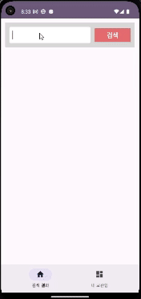

# 앱개발 심화주차 개인과제 TypeB
## 이미지 검색 및 보관 앱
#### (TypeA와 차이점 위주로 작성했습니다)

### 🏷️ 실행 이미지

    
    

    <b>Image 및 Video 함께 받아와 정렬해 출력 Endless Scroll 구현 BottomNavigationView 및 Navigation 이용</b>
    

  
    
    

    <b>리스트 최상단으로 향하는 플로팅 버튼</b>
    

  
    
    

    <b>보관함 선택 및 삭제</b>
    

  
    
    

    <b>로컬 저장 데이터 복구</b>

    

### 📌 요구사항
 

#### 공통

- [x]  MainActivity의 하단 메뉴를 Bottom Navigation 또는 ViewPager+tablayout으로 변경
- [x]  MVVM 패턴을 적용합니다. (ViewModel, ~~LiveData~~) → `LiveData` 대신 `Flow` 사용
- [x]  검색 결과 화면은 보관함을 다녀와도 유지됩니다.
- [x]  보관한 이미지 리스트는 앱 재시작 후 다시 보여야 합니다.
  

#### 이미지 검색 Fragment

- [x]  검색은 키워드 하나에 이미지 검색과 동영상 검색을 동시에 사용, 두 검색 결과를 합친 리스트를 사용합니다.
- [x]  동영상 검색은 API는 (**[링크](https://developers.kakao.com/docs/latest/ko/daum-search/dev-guide#search-video)**)의 thumbnail 필드를 사용합니다.
- [x]  두 검색 결과를 datetime 필드를 이용해 정렬하여 출력합니다. (최신부터 나타나도록)
- [x]  검색 결과 아이템에 [Image] 또는 [Video]를 표시합니다.
- [x]  검색 결과화면에서 마지막 결과로 스크롤시 다음 페이지가 자동 검색 되도록 구현합니다.(무한스크롤 기능)
- [x]  스크롤을 최상단으로 이동시키는 플로팅 액션 버튼을 추가합니다.
- [x]  아이템 선택시 ~~SharedPreference~~에 저장합니다. (DB 사용 금지) → `SharedPreference` 대신 `DataStore` 사용
  

#### 내 보관함 Fragment

- [x]  ~~SharedPreference~~에 저장된 리스트를 불러와 화면에 표시합니다. → `SharedPreference` 대신 `DataStore` 사용
- [x]  보관함에서 이미지 선택시 저장 리스트에서 삭제되며 화면에서도 삭제되도록 구현합니다.
    

### 📝 What to

- Endless Scroll을 지원합니다.
- 검색 결과 최상단으로 향하는 플로팅 버튼을 구현했습니다.
- 동영상 API도 이용해 이미지 API와 합친 후 정렬해 노출합니다.
- 보관함에서는 최근에 보관한 아이템부터 노출하며, 관련된 변경사항은 다른 View에도 반영됩니다.
- 로컬에 저장된 데이터들은(보관함, 마지막 검색어) 앱 시작시 복구됩니다.
    

### 💡 How to

- 동영상 API를 위한 로직들을 구현해 추가했습니다.
- Endless scroll을 위해 `SearchViewModel` 내에 페이징 로직을 구현했습니다.
- API 결과 호출 시, `Coroutine`의 `async()` 및 `await()`를 활용해 각각의 API를 동시에 요청하도록 했습니다.
- `SearchViewModel` 내의 `pagingMeta`가 가변형 프로퍼티라 Race Condition 문제가 발생하는 상황이 있을 수 있다 생각해서, `Mutex`를 활용해 보았습니다.
- 이미지와 동영상 아이템 View의 형식이나 형태적 차이가 크지 않아보여서 `RecyclerView` 내에서 단일 뷰 타입로 처리했습니다.
- 
    

### 기타
- **[TypeA 링크](https://github.com/winteryy/nbc_search/tree/main)**