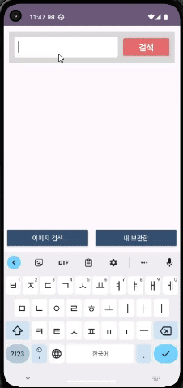
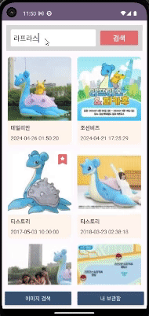
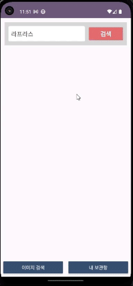

# 앱개발 심화주차 개인과제 TypeA
## 이미지 검색 및 보관 앱
### 🏷️ 실행 이미지

    
    

    <b>초기 상태에서 검색 후 보관함 저장 (저장 시간 기준 내림차순 정렬)</b>
    

  
    
    

    <b>검색어 달라져도 모든 로직 동작</b>
    

  
    
    

    <b>재실행 시, 마지막 검색어 자동완성 및 보관함 데이터 복구</b>

    

### 📌 요구사항
 

- [x] 이미지를 검색해서 보관함에 수집하는 안드로이드 앱을 구현합니다.
- [x] 키워드를 입력하고 검색을 누르면 이미지 검색 결과 리스트를 보여주도록 구현합니다.
- [x] 이미지 검색 API는 ([**링크**](https://developers.kakao.com/docs/latest/ko/daum-search/dev-guide#search-image))의 thumbnail_url 필드를 사용합니다.
- [x] UI는 fragment 2개를 사용합니다.(버튼이나 탭 선택 시 전환)
  

#### MainActivity

- [x] Fragment를 보여줄 FrameLayout을 만들고, 하단에 2개의 버튼(이미지 검색, 내보관함) 을 생성합니다.
- [x] MainActivity 시작시 이미지 검색 fragment를 초기화면에 설정합니다.
  

#### 이미지 검색 Fragment

- [x]  검색어를 입력할 수 있도록 검색창을 구현합니다.
- [x]  검색어를 입력하고 검색 버튼을 누르면 검색된 이미지 리스트를 보여줍니다.
- [x]  검색 버튼을 누르면 키보드는 숨김 처리하도록 구현합니다.
- [x]  API 검색 결과에서 thumbnail_url, display_sitename, datetime을 받아오도록 구현 합니다.
- [x]  RecyclerView의 각 아이템 레이아웃을 썸네일 이미지, 사이트이름, 날짜 시간 으로 구현 합니다.
- [x]  API 검색 결과를 RecyclerView에 표시하도록 구현합니다.
- [x]  날짜 시간은 "yyyy-MM-dd HH:mm:ss” 포멧으로 노출되도록 구현합니다.
- [x]  검색 결과는 최대 80개까지만 표시하도록 구현합니다.
- [x]  리스트에서 특정 이미지를 선택하면 **특별한 표시**를 보여주도록 구현합니다. (좋아요/별표/하트 등)
- [ ]  ~~선택된 이미지는 MainActivity의 ‘선택된 이미지 리스트 변수’에 저장합니다.~~ → 클린 아키텍처의 Data 레이어 이용하는 것으로 대체했습니다(`DataStore`로 구현).
- [x]  마지막 검색어는 저장 되며, 앱 재시작시 마지막 검색어가 검색창 입력 필드에 자동으로 입력됩니다.
  

#### 내 보관함 Fragment

- [ ]  ~~MainActivity의 ‘선택된 이미지 리스트 변수’에서 데이터를 받아오도록 구현합니다.~~ → 클린 아키텍처의 Data 레이어 이용하는 것으로 대체했습니다(`DataStore`로 구현).
- [x]  내보관함 Recyclerview는 ‘이미지는 검색’ 과 동일하게 구현합니다.
- [x]  내보관함에 보관된 이미지를 선택하면 보관함에서 제거할 수 있도록 구현합니다
    

### 📝 What to

- Kakao Developers의 이미지 검색 API를 통해 검색된 이미지를 노출하고 보관함에 저장할 수 있습니다.  
- `MainActivity`를 통해 보관함 정보를 캐싱하는 것을 제외한 모든 요구사항에 맞추어 구현 했습니다.
- 검색 결과를 보여주는 화면에서 아이템을 클릭해 보관함에 추가가 가능하며, 이미 추가된 아이템일 경우 보관함에서 삭제합니다.
- 보관함에서는 저장된 아이템을 출력하며, 클릭 시 보관함에서 삭제합니다. 이는 앱이 종료되어도 유지됩니다.
    

### 💡 How to

- 클린 아키텍처(3-layer) 및 MVVM 패턴을 채택했습니다.
- `Hilt`를 통해 DI를 구현했습니다.
- `DataStore` 및 `Flow`를 활용하여, 로컬에 저장되는 보관함 변경사항을 실시간으로 `View`에 반영합니다.
- `Retrofit`을 통해 네트워크에 접근하며, API 요청 결과를 받아옵니다.
- `Coil`을 통해 `View`에 필요한 이미지를 load 하고 있습니다.
- MVVM 패턴 내에서, `StateFlow`와 정의한 UiState를 사용하고 있습니다.
- 각 이미지에 대한 마땅한 식별자가 없어, 고유함이 보장되는 `thumbnail_url`을 일종의 primary key로 사용했습니다.
- 보관함 저장 정보는 `HashMap` 형태로 받아와서, 네트워크 검색 결과와 병합할 때 보관함 내 존재여부를 빠르게 확인할 수 있습니다.
- `Date`를 UI에 필요한 형태로 포맷팅 하는 메소드와 소프트 키보드를 숨기는 메소드는 확장함수로 빼두었습니다.
- 마지막 검색어는 `SharedPreference`를 통해 관리됩니다.